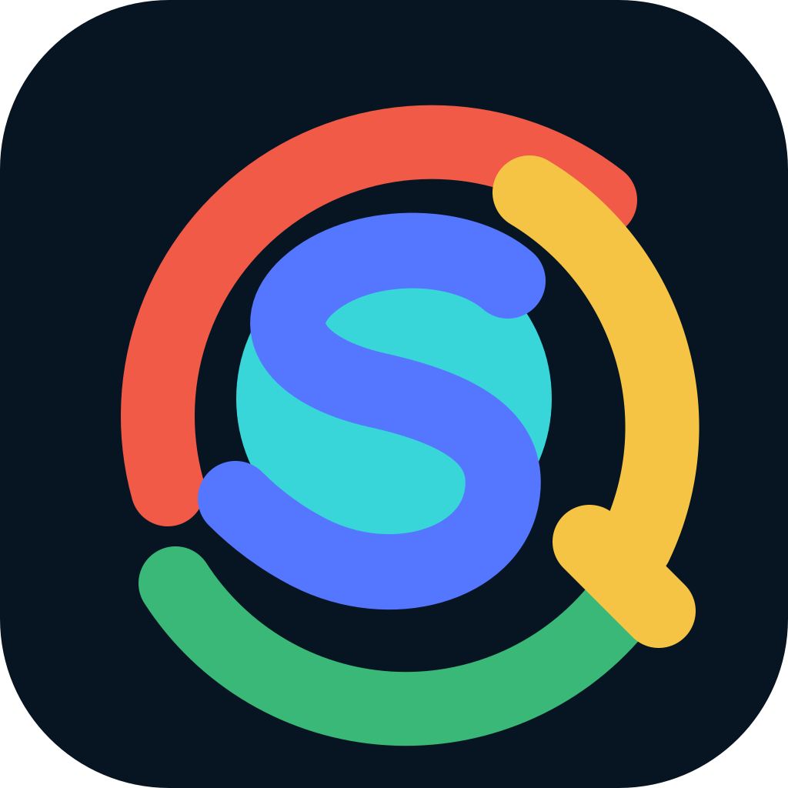

<p align="center">
  
</p>

<h1 align="center">SlyBrowser</h1>

<p align="center"><strong>Native Chromium profiles for reliable browser automation.</strong></p>

<p align="center">
  <a href="LICENSE"></a>
  <a href="SECURITY.md"></a>
  
</p>

SlyBrowser is a Chromium-based browser distribution and multi-language SDK for
launching isolated, reproducible browser profiles from automation frameworks. Profile
settings are applied in the native browser layer so the browser, renderer, workers,
iframes, and WebRTC stack share one configuration.

## Verified advantage over stock Chromium

The latest headed comparison used the same Windows x64 host, network, time window and
40-entry test definition. SlyBrowser ran through the public Node package, its exact
matched project WebDriver, Native Humanize in `careful` mode and the benchmark profile;
the stock Chromium baseline ran through Playwright.

| Metric | SlyBrowser | Stock Chromium | Measured advantage |
| --- | ---: | ---: | ---: |
| Coverage-adjusted score | **80.01** | 71.11 | **+8.90** |
| Raw measured score | **88.74** | 78.86 | **+9.88** |
| Core automation signals | **100.00** | 80.00 | **+20.00** |
| Bot-detection checks | **82.30** | 73.26 | **+9.04** |
| Page / iframe / worker consistency | **100.00** | 94.44 | **+5.56** |
| Required coverage | 90.16% | 90.16% | Same coverage |

SlyBrowser also scored **100 vs 73.91** on Device & Browser Info and **92.31 vs
69.23** on its interaction test. Both the Node and Python packages passed the headed
Native Humanize Page/Frame/Element/DPI runtime matrix against the compiled x64 browser.
See the [complete dated comparison](docs/benchmark-latest.md), including every FAIL,
ERROR, EVIDENCE and SKIP result.

> [!IMPORTANT]
> This repository is in private incubation. Package names, APIs, download endpoints,
> and binary license terms may change before the first public preview.

## Intended capabilities

- Project-built W3C WebDriver as the default JavaScript and Python backend.
- Playwright and Puppeteer as explicit optional adapters.
- Persistent and ephemeral user-data directories.
- A validated 29-group native profile contract covering identity, locale,
  timezone, screen, geolocation, proxy, WebRTC, graphics, audio, device, and
  browser-policy inputs.
- Signed browser release manifests with SHA-256 artifact verification.
- Short-lived, signed license leases with explicit feature and session limits.
- Python, Node.js, and .NET SDKs backed by shared JSON contracts.
- Deterministic build, packaging, smoke-test, and test-page automation.

## Source and license boundary

SlyBrowser deliberately separates its public SDK from its browser implementation:

| Deliverable | Location | License |
| --- | --- | --- |
| SDKs, schemas, scripts, tests, and documentation | This repository | [MIT](LICENSE), except where noted |
| SlyBrowser name and logo | `assets/brand` | Reserved trademark/brand assets |
| Modified Chromium C++ source | Private source checkout | Not published by this repository |
| Distributed SlyBrowser browser binary | Release channel | Release-specific proprietary binary license plus applicable open-source licenses |
| Chromium and bundled third-party components | Browser source/binary | Their respective upstream licenses and notices |

Read [LICENSE-SCOPE.md](LICENSE-SCOPE.md) before redistributing any deliverable. The
commercial binary terms cannot remove rights independently granted by Chromium or any
third-party component.

## Repository layout

```text
assets/brand/       Approved icon and brand files
contracts/          Shared launch and signed-release schemas
docs/               Architecture, licensing, and release design
packages/python/    Python SDK and CLI (project WebDriver default)
packages/node/      TypeScript SDK (project WebDriver default)
packages/dotnet/    .NET SDK and CLI
packages/license-service/ Private entitlement, concurrency, lease and artifact service
scripts/            Build, packaging, signing, and verification entry points
tests/              Contract, integration, and browser test-page suites
```

The modified Chromium checkout and signing private keys must never be copied into this
repository. Browser packages are attached to releases only after license scanning,
testing, hashing, and manifest signing.

## Default project WebDriver

JavaScript and Python `launch()` use the project-built `chromedriver` beside the
SlyBrowser executable by default. They never invoke Selenium Manager, search `PATH`,
download a driver, or fall back to a system Chrome installation. An explicit path or
`SLYBROWSER_WEBDRIVER_PATH` may override the sibling location; the SDK rejects a
browser/driver major-version mismatch. Production drivers additionally require the
exact hash-matched SlyBrowser executable beside the driver and independently verify a
short-lived signed lease.

```ts
import { launch } from "slybrowser";

await using browser = await launch(browserExecutable, shortLivedLease, {
  humanize: true,
  humanPreset: "careful",
});
await browser.get("https://example.test");
await (await browser.findElement("input[name=q]")).type("SlyBrowser");
```

```python
from slybrowser import launch

with launch(browser_executable, short_lived_lease, humanize=True,
            human_preset="careful") as browser:
    browser.get("https://example.test")
    browser.find_element("input[name=q]").type("SlyBrowser")
```

Playwright and Puppeteer remain available through the explicitly named
`launchPlaywright`, `launchPuppeteer`, `launch_playwright`, and related functions.

## Authorized latest release

The Node and Python SDKs can exchange a generated authorization file for a short-lived
signed lease, reserve plan concurrency, select the newest compatible Stable manifest,
download the protected browser archive and launch its exact project WebDriver pair.
Archive and per-executable SHA-256 values are signed; cached runtime files are checked
again before every load.

```ts
import { launchLatest } from "slybrowser";

await using browser = await launchLatest("account.authorization.json", {
  trust: { licenseTrustedKeys, releaseTrustedKeys },
  humanize: true,
});
```

The enforced monthly plan matrix is Free $0 / 1 process, Launch $19 / 5, Studio $49 /
20, Fleet $199 / 200 and Grid $499 / 2,000. The complete signing, authorization,
deployment and rotation procedure is in
[Authorized browser delivery](docs/authorized-release-service.md).

## Humanized interaction

The default WebDriver backend implements Humanize natively inside Sly WebDriver. The
Node.js Playwright/Puppeteer adapters retain their framework implementation. Both use
trusted mouse and keyboard input, curved non-center pointer paths, variable key timing,
click holds, and short thinking pauses:

```ts
import { launch } from "slybrowser";

const browser = await launch(browserExecutable, lease, {
  humanize: true,
  humanPreset: "careful",
  humanSeed: 42424, // omit outside reproducible tests
});
```

`humanSeed` exists for repeatable regression tests. Production sessions should omit
it. Explicit Playwright/Puppeteer adapters preserve framework-specific overrides such
as force, modifier, button, position, and delay. The native capability and production
browser/driver validation model are documented in
[Native WebDriver Humanize and runtime pairing](docs/webdriver-humanize-and-pairing.md).

## Development status

The shared contracts and Python, Node.js, and .NET SDK source are present. Python and
Node.js tests pass locally; .NET source still requires validation on a machine with a
.NET SDK. The private Chromium development build compiles and its 21 focused native
license/profile tests pass, but production enforcement, release signing, full Chromium
test targets, and third-party license clearance remain release gates. The supported
native settings and explicit gaps are listed in
[Native profile configuration](docs/profile-configuration.md).

The current 40-entry benchmark, complete result table and limitations are recorded in
[the latest public comparison](docs/benchmark-latest.md). This is development evidence,
not a claim that every website or protection service will accept a session.

The current feature-matched commercial boundary, package gates and validation plan are
recorded in
[Business model customization](docs/business-model-customization-2026-08-16.md). The
broader competitor sample remains in
[Business model research](docs/business-model-research-2026-08-15.md). Production
checkout remains gated by approved legal terms and a deployed payment webhook.

Native browser support is currently limited to Windows x64. Node.js and Python SDK
contracts are tested across Windows, Linux and macOS, but no other native browser
artifact is implied. See the [supported platform and runtime matrix](docs/support-matrix.md).

The benchmark can run through either Playwright or the project's explicitly selected,
self-built W3C WebDriver; setup and evidence rules are in
[Detection benchmark](docs/detection-benchmark.md).

## Responsible use

Use SlyBrowser only on systems and websites you own or are authorized to automate.
Credential attacks, unauthorized access, fraud, and evasion of access controls are not
supported. See [SECURITY.md](SECURITY.md) for private vulnerability reporting.

## Independence notice

SlyBrowser is an independent project built from Chromium source. It is not Google
Chrome, is not affiliated with Google, and does not ship Google Chrome branding.
Chromium and Google Chrome are trademarks of their respective owners.
