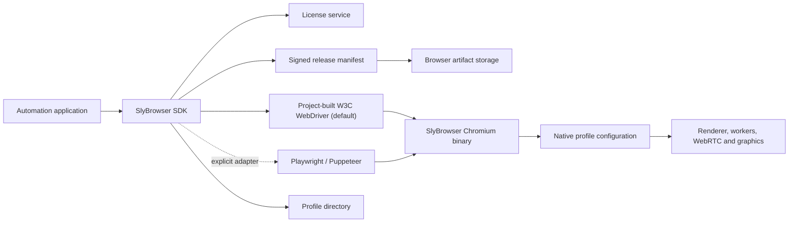

# Architecture

SlyBrowser separates public automation clients from the private browser build while
keeping their behavior tied to versioned contracts.

## Public repository

The repository owns configuration contracts, SDK behavior, artifact verification,
launch orchestration, tests, examples, and documentation. It never contains production
signing secrets or the private Chromium checkout.

JavaScript and Python use the project-built W3C WebDriver as their default transport.
The SDK resolves only an explicitly configured driver or the `chromedriver` shipped
beside the selected browser, launches it on a private loopback port, and verifies that
its reported major version matches the browser. It never delegates driver selection
to Selenium Manager or another downloader. Playwright and Puppeteer are retained as
explicit adapters for callers that intentionally choose those transports. In production,
the driver also verifies its own lease and accepts only the exact sibling browser name
and build-time SHA-256. Native Humanize behavior is negotiated through `sly:options`
and executed inside the driver for standard W3C element click and send-keys commands.

## Browser source

The private Chromium checkout applies profile configuration below the JavaScript layer.
Only a narrow, versioned launch contract crosses the SDK/browser boundary. Unknown or
invalid settings fail closed with a structured error instead of being silently ignored.
The current field-level support and rejection behavior is documented in
[Native profile configuration](profile-configuration.md).

## Release trust chain

1. CI builds an SDK package from reviewed repository source.
2. A separate trusted builder produces the browser archive from a recorded Chromium tag
   and SlyBrowser patch revision.
3. The archive is hashed with SHA-256.
4. A manifest names the artifact, size, compatibility range, licenses, and hash.
5. A protected Ed25519 signing service signs the canonical manifest payload.
6. SDKs verify the manifest signature and artifact hash before extraction.

The implemented service returns the newest numerically compatible Stable manifest only
after reserving plan capacity. The Node and Python installers require the artifact URL
to share the service origin, reject redirects, authenticate the download with the
session token, extract ZIP paths safely and re-hash both browser and driver on every
cache load. See [Authorized browser delivery](authorized-release-service.md).

The release signing private key is never present in SDK source, browser source, normal
CI variables, command-line arguments, or release archives.

## Runtime license trust chain

The user's long-lived license key is handled by the SDK, not placed on the browser or
driver command line. The SDK exchanges it over TLS for a short-lived signed lease. The
driver and browser receive distinct restricted temporary copies of that lease, validate
its signature and claims using embedded public keys, consume each file once, and delete
temporary material.

The browser must distinguish configuration errors, missing licenses, invalid signatures,
expiry, unsupported versions, device mismatch, and session-limit denial using stable
error codes that all SDKs map to the same exception types.

The current concurrency store is deliberately a single-authority SQLite implementation
using WAL and `BEGIN IMMEDIATE`. A horizontally scaled service must use one shared
transactional authority such as PostgreSQL; separate SQLite replicas would violate the
concurrency invariant.
